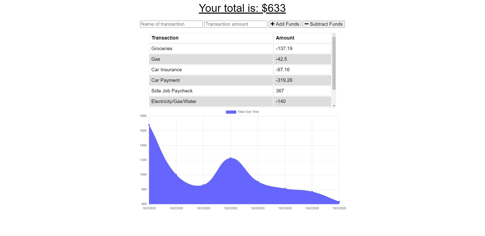

# **_CWBudgetTracker PWA_** 

### **Link to the Live Application:** [https://cwbudgettracker.herokuapp.com/](https://cwbudgettracker.herokuapp.com/)

## **Description**

This is a simple full stack application that we completed in the Case Western Reserve University Full Stack Coding Bootcamp. This was developed using NodeJS, ExpressJS and MongoDB to create an budget tracking application that stores the user income and expense history. On the home page it will show a chart of all your income and expense flow that you have logged.

## **Installation**

After cloning this repository, open the applications main directory in your terminal, and type `npm i` to install all required dependencies. If you are running the app locally then you need to create a `.env` file and declare `MONOGDB_URI` to your MongoDB connection string, if you are running on Heroku, then you will need to configure the variables and enter the MongoDB connection string. For this you will typically be using MongoDB Atlas unless you run your own MongoDB database that is public outside of your home network.

If you are running this locally, you will want to run `npm start` to start the server, or `npm run watch` to start the server with Nodemon to listen and restart the server based on changes that are detected in the files.

If you are running this on Heroku, or other similar platforms, you will have to wait for the app to provision and become live. This may also take longer if you are running a CI platform such as TravisCI for linting.

## **How To Use**

If you are running this app on Heroku, you will want to ensure that the setup has successfully passed, and then launch the app with the URL that is set by heroku.

If you are running this app locally, you will want to navigate to `http://localhost:` and the port that you declared in the `.env` file. If you did not set the port variable, then the default is set to port `3000`.

### **License** MIT

### **How To Contribute**

Submit and pull request and add a feature that you think should be added, I will review and decide to either merge the pull request or deny the Merge Pull Request

### **How To Run Tests**

No tests have been integrated at this point.

### **Frequently Asked Questions**

None

#### **Other Questions**

Find my other projects at https://github.com/MichaelOlshewski/   For other questions, information on projects or if you want to collaborate on a project, please email me at contact@michael-olshewski.com

###### This ReadMe was created with the Read Me Generator from: https://github.com/MichaelOlshewski/CWReadMeGenerator
